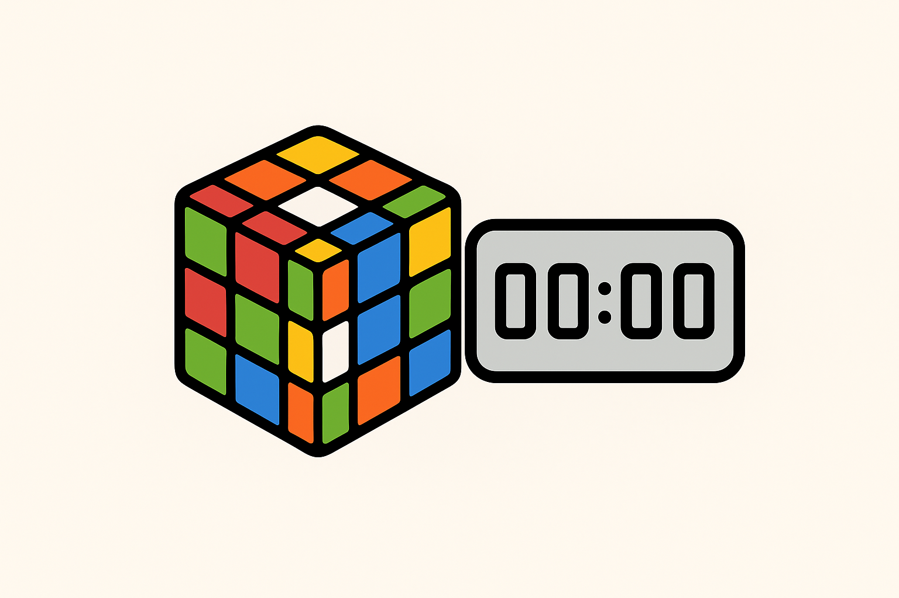

# PSTimer - Professional Speedcubing Timer

A modern, feature-rich Rubik's cube timer application inspired by csTimer, built with Python and Tkinter.



---

## 👥 For End Users

**🚀 [USER_README.md](USER_README.md) - Complete user guide with download instructions, features overview, and how to use PSTimer.**

---

## 🔧 For Developers


## Features

### ✨ Core Features
- **csTimer-inspired UI** - Clean, professional interface matching the popular csTimer layout
- **High-precision timing** - Accurate to centiseconds using Python's `time.perf_counter()`
- **WCA-compliant scrambles** - Official World Cube Association scramble algorithms
- **Multiple puzzle support** - 3x3x3, 2x2x2, 4x4x4, 5x5x5, Pyraminx, Skewb, Megaminx, Square-1
- **Advanced statistics** - mo3, ao5, ao12, ao100 with automatic calculation
- **Session management** - Track multiple solve sessions with detailed statistics
- **3D cube visualization** - Interactive 3D cube that shows scramble state
- **Multiple themes** - csTimer, Dark, and Blue themes
- **Window transparency** - Adjustable transparency for multitasking while solving
- **Compact mode** - Minimal overlay mode with corner positioning for extreme multitasking

### 🎯 Timer Features
- **Space bar controls** - Hold space to ready, release to start, any key to stop
- **Visual feedback** - Timer color changes based on state (ready/running/stopped)
- **Automatic scramble generation** - New scramble after each solve
- **Time history** - Complete solve history with timestamps

### 📊 Statistics
- **Real-time calculation** - Statistics update automatically after each solve
- **Multiple averages** - ao5, ao12, ao100 with proper trimming
- **Best times tracking** - Track personal bests for each statistic
- **Session overview** - Solve count, session mean, current vs best times

### 🎨 User Interface
- **Top navigation bar** - Settings, menu, scramble type selection
- **Left statistics panel** - Current and best times, solve count, times list
- **Center timer display** - Large, clear timer with scramble above
- **Right cube panel** - 3D interactive cube visualization
- **Responsive design** - Adapts to different window sizes

## Installation

### Prerequisites
- Python 3.7 or higher
- tkinter (usually included with Python)

### Quick Start
1. Clone or download this repository
2. Navigate to the project directory
3. Run the application:
   ```bash
   python main.py
   ```

## Usage

### Basic Controls
- **Space bar**: Hold to ready the timer, release to start
- **Any key**: Stop the timer (while running)
- **S key**: Generate new scramble
- **R key**: Reset timer to zero
- **Ctrl + =**: Increase window transparency (more opaque)
- **Ctrl + -**: Decrease window transparency (more see-through)
- **Ctrl + 0**: Reset transparency to fully opaque
- **Ctrl + M**: Toggle compact mode (minimal overlay)
- **Ctrl + 1-4**: Set compact position (top-left/top-right/bottom-left/bottom-right)

### Timer Workflow
1. **Ready**: Hold space bar until timer turns green
2. **Start**: Release space bar to start timing
3. **Stop**: Press any key to stop the timer
4. **Record**: Time is automatically recorded and statistics updated
5. **Next**: New scramble is generated automatically

### Navigation
- **Previous/Next scramble**: Use ◀ ▶ buttons in top bar
- **Scramble type**: Select from dropdown (3x3x3, 2x2x2, 4x4x4, 5x5x5, Pyraminx, Skewb, Megaminx, Square-1)
- **Settings**: Click ⚙ button to configure puzzle type, themes, and preferences
- **Menu**: Click ☰ button for session management and about dialog

### WCA Compliance
PSTimer uses **World Cube Association (WCA) compliant** scramble algorithms:
- Follows official WCA scrambling specifications
- Tournament-legal scrambles for all supported puzzles
- Proper move restrictions and sequence validation
- See `WCA_COMPLIANCE.md` for detailed specifications

## Project Structure

```
pstimer/
├── main.py                 # Main entry point
├── src/                    # Source code modules
│   ├── __init__.py
│   ├── timer.py           # Core timer functionality
│   ├── scramble.py        # Scramble generation
│   ├── statistics.py      # Statistics calculation and session management
│   ├── themes.py          # Theme management
│   ├── cube_visualization.py  # 3D cube visualization
│   └── ui.py              # Main UI implementation
└── README.md              # This file
```

## Architecture

### Modular Design
The application is built with a modular architecture for maintainability:

- **Timer Module** (`timer.py`): High-precision stopwatch implementation
- **Scramble Module** (`scramble.py`): Extensible scramble generation system
- **Statistics Module** (`statistics.py`): Session management and statistics calculation
- **Themes Module** (`themes.py`): Centralized theme and styling management
- **Cube Visualization** (`cube_visualization.py`): 3D cube rendering and interaction
- **UI Module** (`ui.py`): Main application interface and event handling

### Key Classes

#### `Stopwatch`
- High-precision timing using `time.perf_counter()`
- Start/stop/reset functionality
- Time formatting for speedcubing (MM:SS.cc format)

#### `ScrambleManager`
- Supports multiple puzzle types
- Scramble history navigation
- Extensible generator system

#### `SessionManager` & `Session`
- Multiple session support
- Solve recording with metadata
- Automatic statistics calculation

#### `StatisticsCalculator`
- Standard speedcubing statistics (mo3, ao5, ao12, ao100)
- Proper trimming algorithms
- Best time tracking

#### `ThemeManager`
- Multiple color themes
- Consistent styling across application
- Easy theme switching

#### `CubeVisualization`
- 3D cube rendering
- Mouse interaction for rotation
- Scramble state visualization

## Themes

### Available Themes
1. **csTimer** (default) - Clean white theme matching csTimer
2. **Dark** - Dark theme for low-light environments  
3. **Blue** - Blue accent theme

### Theme Structure
Each theme includes:
- Background colors (main, secondary, sidebar, panel)
- Text colors (primary, secondary, hint)
- Accent colors for interactive elements
- Timer state colors (normal, ready, running)
- Font specifications

## Statistics Explanation

### Averages
- **mo3**: Mean of 3 - Simple average of last 3 solves
- **ao5**: Average of 5 - Remove best and worst, average middle 3
- **ao12**: Average of 12 - Remove best and worst, average middle 10
- **ao100**: Average of 100 - Remove best 5 and worst 5, average middle 90

### Current vs Best
- **Current**: Statistics based on most recent solves
- **Best**: Best achieved statistics in the current session

## Keyboard Shortcuts

| Key | Action |
|-----|--------|
| Space (hold) | Ready timer |
| Space (release) | Start timer |
| Any key | Stop timer |
| S | New scramble |
| R | Reset timer |

## Development

### Extending Scramble Types
To add a new puzzle type:

1. Create a new scramble generator class inheriting from `ScrambleGenerator`
2. Implement the `generate()` method
3. Add to `ScrambleManager.SCRAMBLE_TYPES`

Example:
```python
class FiveByFiveScramble(ScrambleGenerator):
    def generate(self):
        # Implementation here
        return scramble_string
```

### Adding Themes
To add a new theme:

1. Add theme definition to `ThemeManager.THEMES`
2. Include all required color keys
3. Theme will be automatically available in UI

### Contributing
1. Follow the existing code style
2. Add docstrings to new functions/classes
3. Test thoroughly before submitting
4. Update README if adding new features

## Known Limitations

- Cube visualization is simplified (not a full cube simulator)
- Settings dialog not yet implemented
- No save/load session functionality
- Limited to basic puzzle types

## Future Enhancements

- [ ] Complete settings panel implementation
- [ ] Session save/load functionality
- [ ] More puzzle types (5x5, 6x6, 7x7, Pyraminx, etc.)
- [ ] Graph/chart visualization of solve times
- [ ] Import/export functionality
- [ ] Full cube state simulation
- [ ] Inspection time feature
- [ ] Solve penalties (+2, DNF)

## 📦 Packaging & Distribution

### Creating Standalone Executables

To create standalone executables for distribution, you can use PyInstaller:

#### Prerequisites
```bash
pip install pyinstaller
```

#### Windows Executable
```bash
# Create a single executable file
pyinstaller --onefile --windowed --name PSTimer --icon=logo.ico main.py

# Or create a directory distribution (faster startup)
pyinstaller --windowed --name PSTimer --icon=logo.ico main.py
```

#### macOS App Bundle
```bash
# Create .app bundle
pyinstaller --onefile --windowed --name PSTimer --icon=logo.icns main.py
```

#### Linux Executable
```bash
# Create Linux executable
pyinstaller --onefile --name PSTimer main.py
```

#### Advanced Packaging Options
```bash
# Include additional files (if needed)
pyinstaller --onefile --windowed --name PSTimer --icon=logo.ico \
    --add-data "logo.png;." \
    --add-data "src;src" \
    main.py
```

### Distribution Package Structure
After building, create distribution packages:

```
PSTimer-v1.0-Windows/
├── PSTimer.exe
├── logo.png
├── USER_README.md
└── LICENSE

PSTimer-v1.0-macOS/
├── PSTimer.app/
├── logo.png
├── USER_README.md
└── LICENSE

PSTimer-v1.0-Linux/
├── PSTimer
├── logo.png
├── USER_README.md
└── LICENSE
```

### Creating Releases
1. **Build for all platforms** using the commands above
2. **Test executables** on clean systems
3. **Create ZIP packages** for each platform
4. **Upload to GitHub Releases** with version tags
5. **Include USER_README.md** in each package for end users

### Icon Conversion
To create icons for different platforms:

```bash
# Convert PNG to ICO (Windows)
# Use online converter or ImageMagick:
convert logo.png -define icon:auto-resize=16,24,32,48,64,128,256 logo.ico

# Convert PNG to ICNS (macOS)
# Use iconutil or online converter
mkdir logo.iconset
sips -z 16 16 logo.png --out logo.iconset/icon_16x16.png
sips -z 32 32 logo.png --out logo.iconset/icon_16x16@2x.png
# ... (repeat for all sizes)
iconutil -c icns logo.iconset
```

### GitHub Actions (Optional)
Create `.github/workflows/build.yml` for automatic building:

```yaml
name: Build PSTimer
on: [push, release]
jobs:
  build:
    runs-on: ${{ matrix.os }}
    strategy:
      matrix:
        os: [windows-latest, macos-latest, ubuntu-latest]
    steps:
    - uses: actions/checkout@v2
    - name: Set up Python
      uses: actions/setup-python@v2
      with:
        python-version: 3.9
    - name: Install dependencies
      run: pip install pyinstaller
    - name: Build executable
      run: pyinstaller --onefile --windowed --name PSTimer main.py
    - name: Upload artifacts
      uses: actions/upload-artifact@v2
      with:
        name: PSTimer-${{ matrix.os }}
        path: dist/
```

## License

This project is open source. Feel free to use, modify, and distribute.

## Acknowledgments

- Inspired by csTimer (https://cstimer.net/)
- Built with Python and Tkinter
- Thanks to the speedcubing community for feedback and suggestions
