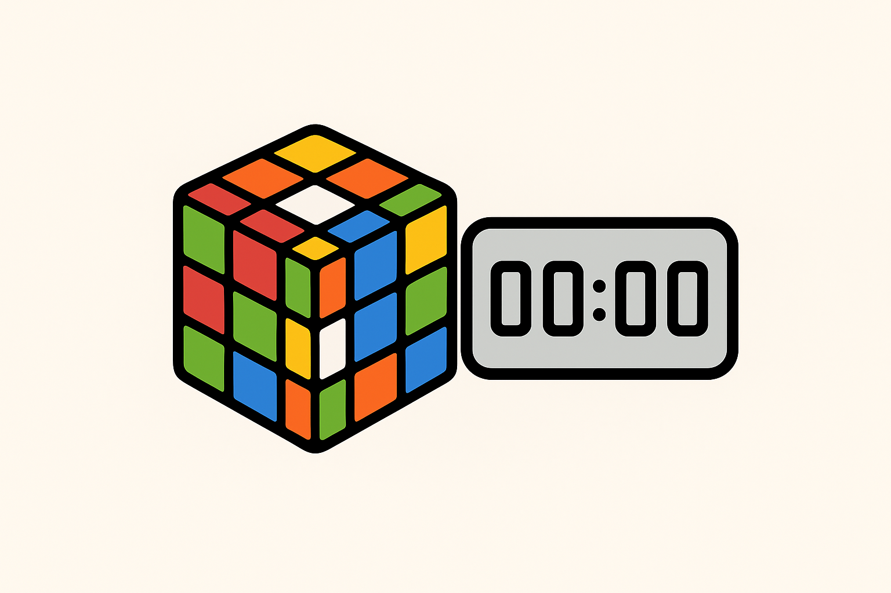

# PSTimer - Professional Speedcubing Timer



A modern, feature-rich Rubik's cube timer application inspired by csTimer. Perfect for speedcubers of all levels, from beginners to competitive solvers.

## 🚀 Quick Start

### Download & Installation

#### Option 1: Download Pre-built Release (Recommended)
1. Go to the [Releases](../../releases) page
2. Download the latest `PSTimer-v*.zip` file for your operating system
3. Extract the ZIP file to your desired location
4. Run the executable:
   - **Windows**: Double-click `PSTimer.exe`
   - **macOS**: Double-click `PSTimer.app`
   - **Linux**: Run `./PSTimer` in terminal

#### Option 2: Run from Source Code
1. **Prerequisites**: Python 3.7+ installed on your system
2. **Download**: Clone or download this repository
3. **Extract**: Unzip to your desired folder
4. **Run**: Open terminal/command prompt in the PSTimer folder and run:
   ```bash
   python main.py
   ```

## ✨ Features

### 🎯 **Core Timer Features**
- **csTimer-inspired Interface** - Familiar layout for experienced cubers
- **High-precision Timing** - Accurate to centiseconds using advanced timing methods
- **WCA-compliant Scrambles** - Official tournament-legal scrambles for all events
- **Multiple Puzzle Support** - 3x3x3, 2x2x2, 4x4x4, 5x5x5, Pyraminx, Skewb, Megaminx, Square-1

### 📊 **Advanced Statistics**
- **Real-time Averages** - mo3, ao5, ao12, ao100 with automatic calculation
- **Best Times Tracking** - Personal records for each statistic type
- **Session Management** - Multiple solve sessions with detailed history
- **Export Functionality** - Save your times for external analysis

### 🎨 **Customization**
- **Multiple Themes** - csTimer (light), Dark, and Blue themes
- **Window Transparency** - Adjustable for multitasking while solving
- **Compact Mode** - Minimal overlay that stays on top for extreme multitasking

### 🎮 **Interactive Features**
- **3D Cube Visualization** - See your scramble state in real-time 3D
- **Keyboard Controls** - Space bar timing, quick shortcuts for everything
- **Inspection Time** - Optional 15-second inspection period

## 🎮 How to Use

### Basic Timer Operation

1. **Ready the Timer**
   - Hold down the **Space bar** until the timer turns green (ready state)
   - This ensures you're ready to start timing

2. **Start Timing**
   - Release the **Space bar** to start the timer
   - Timer begins counting immediately

3. **Stop Timing**
   - Press **any key** while the timer is running to stop
   - Your time is automatically recorded and statistics updated

4. **New Scramble**
   - A new scramble is generated automatically after each solve
   - Or press **S** to generate a new scramble manually

### Keyboard Controls

| Key | Action |
|-----|--------|
| **Space** | Hold to ready timer, release to start |
| **Any Key** | Stop the timer (while running) |
| **S** | Generate new scramble |
| **R** | Reset current timer to 0:00.00 |
| **Ctrl + M** | Toggle compact mode |
| **Ctrl + =** | Increase transparency (more see-through) |
| **Ctrl + -** | Decrease transparency (more opaque) |
| **Ctrl + 0** | Reset transparency to fully opaque |
| **Ctrl + 1-4** | Set compact mode position (corners) |

### Interface Layout

```
┌─────────────────────────────────────────────────────────────────┐
│ [☰] PSTimer                    [3x3x3 ▼] [◀] [▶] [⚙]           │ ← Top Bar
├─────────────────────────────────────────────────────────────────┤
│ Statistics │        Timer & Scramble        │  3D Cube Visual │
│            │                                │                 │
│ • mo3      │         00:23.45               │     [Cube]      │
│ • ao5      │                                │                 │
│ • ao12     │  R U R' U' F R F' U R U'       │                 │
│ • ao100    │                                │                 │
│            │                                │                 │
│ Solve List │        [Space to start]        │                 │
│ 1. 23.45   │                                │                 │
│ 2. 25.12   │                                │                 │
│ 3. 22.89   │                                │                 │
└─────────────────────────────────────────────────────────────────┘
```

## 🔧 Settings & Customization

### Accessing Settings
Click the **⚙ (gear)** button in the top-right corner to open settings.

### Available Settings

#### **Timer Settings**
- **Hold Time**: How long to hold Space before timer is ready (default: 300ms)
- **Inspection Time**: Enable 15-second inspection period
- **Auto-generate Scrambles**: Generate new scramble after each solve

#### **Appearance**
- **Theme Selection**: Choose between csTimer, Dark, or Blue themes
- **Window Transparency**: Adjust overall window opacity
- **Compact Mode Position**: Set preferred corner position

#### **Puzzle Settings**
- **Default Puzzle Type**: Set your preferred puzzle (3x3x3, 2x2x2, etc.)
- **Scramble Length**: Customize scramble length for some puzzles

### Compact Mode

Perfect for multitasking while practicing:

1. Press **Ctrl + M** to enter compact mode
2. Small 280x150px window appears in chosen corner
3. Contains timer, scramble, and essential controls
4. Always stays on top of other windows
5. Use **Ctrl + 1-4** to position in different corners:
   - **Ctrl + 1**: Top-left
   - **Ctrl + 2**: Top-right (default)
   - **Ctrl + 3**: Bottom-left
   - **Ctrl + 4**: Bottom-right

## 📊 Understanding Statistics

### Statistic Types
- **mo3 (Mean of 3)**: Simple average of your last 3 solves
- **ao5 (Average of 5)**: Average of last 5 solves (removes best and worst)
- **ao12 (Average of 12)**: Average of last 12 solves (removes best and worst)
- **ao100 (Average of 100)**: Average of last 100 solves (removes 5 best and 5 worst)

### Session Management
- **Current Session**: Your active solving session with live statistics
- **Session History**: Review past sessions and compare performance
- **Export Times**: Save your solve times to CSV for external analysis

## 🧩 Supported Puzzles

| Puzzle | Scramble Length | Notes |
|--------|----------------|-------|
| **3x3x3 Cube** | 20 moves | Standard Rubik's cube |
| **2x2x2 Cube** | 11 moves | Pocket cube |
| **4x4x4 Cube** | 40 moves | Includes wide moves (Uw, Rw, etc.) |
| **5x5x5 Cube** | 60 moves | Professor's cube |
| **Pyraminx** | 11 + tips | Includes tip rotations |
| **Skewb** | 11 moves | Corner-turning puzzle |
| **Megaminx** | 77 moves | 12-sided puzzle |
| **Square-1** | 20 moves | Shape-shifting puzzle |

All scrambles follow **World Cube Association (WCA)** official specifications and are tournament-legal.

## 🎨 Themes

### csTimer Theme (Default)
Clean white theme matching the popular csTimer layout - perfect for competition preparation.

### Dark Theme
Modern dark theme that's easy on the eyes during long practice sessions.

### Blue Theme
Professional blue color scheme for a unique look.

## 🔄 Data Export

Export your solving data for analysis in external tools:

1. Click **☰ (menu)** in top-left corner
2. Select **"Export Times"**
3. Choose export format (CSV, TXT)
4. Save file to analyze in spreadsheet software

## 🆘 Troubleshooting

### Common Issues

**Timer not starting?**
- Make sure to hold Space bar until it turns green before releasing
- Check that the timer isn't already running

**Scrambles look wrong?**
- Verify you have the correct puzzle type selected in the dropdown
- All scrambles follow WCA regulations and may look different from other generators

**Window transparency not working?**
- This feature may not be available on all operating systems
- Try updating your graphics drivers

**3D cube not displaying?**
- The 3D visualization requires OpenGL support
- Update your graphics drivers or disable 3D visualization in settings

### Getting Help

- **Bug Reports**: Open an issue on the GitHub repository
- **Feature Requests**: Suggest new features in the issues section
- **General Questions**: Check the documentation or ask the community

## 📝 Tips for Better Practice

1. **Consistent Environment**: Use the same settings and theme for all practice
2. **Focus on Averages**: Single times fluctuate; averages show true improvement
3. **Regular Sessions**: Short, frequent sessions are better than long, infrequent ones
4. **Track Progress**: Use the export feature to analyze your improvement over time
5. **WCA Compliance**: Practice with the same scrambles you'll see in competition

## 🎯 About WCA Compliance

PSTimer generates scrambles that are 100% compliant with World Cube Association regulations:

- **No consecutive moves** on the same face (e.g., R R)
- **Proper opposite face restrictions** (e.g., R L R is not allowed)
- **Official move notation** for all supported puzzles
- **Tournament-legal sequences** suitable for competition practice

This means you can trust PSTimer for serious competition preparation!

---

**Happy Cubing!** 🎲✨

*PSTimer - Bringing the best of csTimer to your desktop with modern features and professional reliability.*
